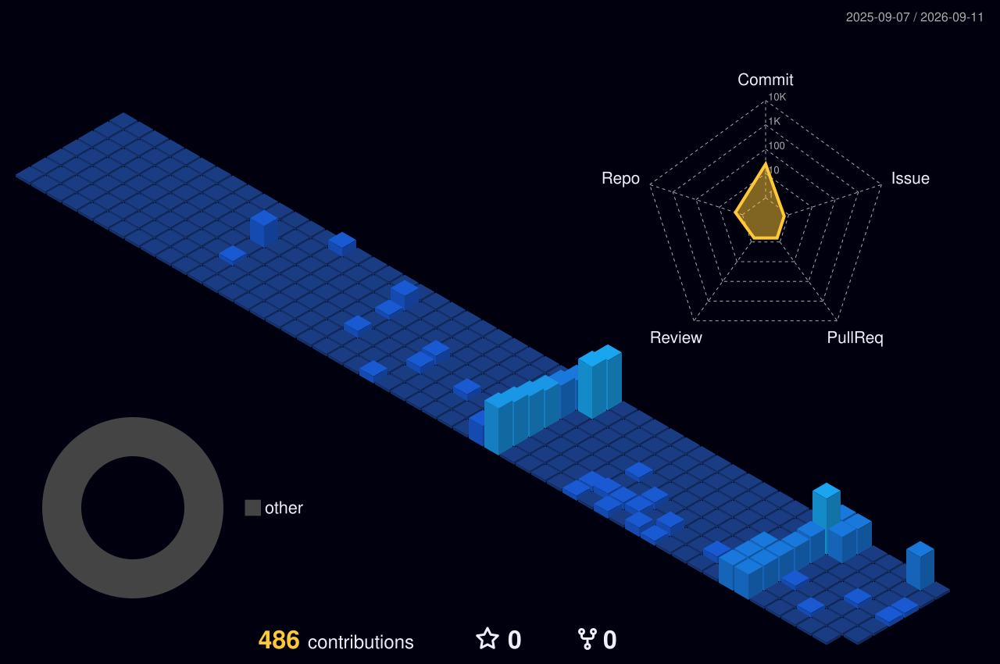

# Salut, je suis AETHERION-220 👋

Bienvenue sur mon profil ! En tant que passionné d'informatique, je considère cet espace comme un véritable projet technologique à part entière, conçu pour mettre en valeur l'ensemble de mes travaux, de l'architecture système à la cybersécurité.

### 🛠️ Mes Outils & Technologies

  

---

### 📊 L'activité de mes projets

<table width="100%" style="border: none; background-color: transparent;">
  <tr>
    <!-- ========================================== -->
    <!-- COLONNE GAUCHE : Statistiques (60%)        -->
    <!-- ========================================== -->
    <td width="60%" valign="top">
      
      <!-- Stats globales (Issues, PRs, etc.) -->
      
      
        

      <!-- NOUVEAU : Langages les plus utilisés (comme sur la photo) -->
      

        

      <!-- Calendrier 3D -->
      <picture>
        <source media="(prefers-color-scheme: dark)" srcset="profile-3d-contrib/profile-night-view.svg">
        <source media="(prefers-color-scheme: light)" srcset="profile-3d-contrib/profile-view.svg">
        
      </picture>

    </td>

    <!-- ========================================== -->
    <!-- COLONNE DROITE : Streak & Personnage (40%) -->
    <!-- ========================================== -->
    <td width="40%" valign="top" align="center">
      
      <!-- Le Widget Streak (La flamme) -->
      
      
        

      <!-- L'image de ton personnage -->
      <!-- /!\ REMPLACE LE LIEN CI-DESSOUS PAR L'URL DE TON IMAGE /!\ -->
      

    </td>
  </tr>
</table>
