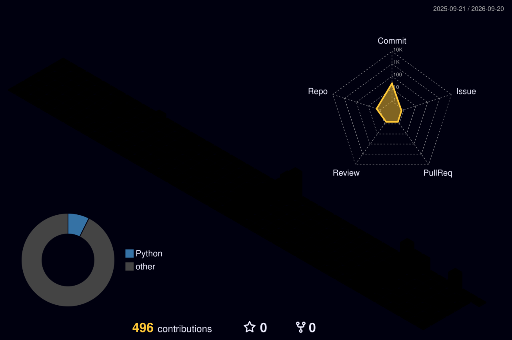

> Always coding — sometimes exploring data, sometimes building software. 
> *Each project helps me think deeper, write better programs and turn raw data into something useful.*

> *“Now is the time to take risks. Do something bold. You won’t regret it.”* — **Elon Musk**

## 📊 Developer dashboard

<table>
  <tr>
    <td width="390" valign="top">
      
       
      
       
      
       
      
    </td>
    <td width="410" align="center" valign="top">
      
       
      
       
      
       
      
       
      
    </td>
  </tr>
</table>

---

## 💻 Languages

  

 

  
  
  
  
  
  
  
  

## 🌐 Big Data & Data Engineering

  
  
  
  
  
  

## 🧠 Data Science & AI

  
  
  
  
  
  
  

## 🗄️ Databases, Cloud & Tools

  

---

## 📈 Contribution activity

  

---

## 🎮 Gaming corner

<table align="center">
  <tr>
    <td width="50%" align="center">
      
       <b>Naruto</b> 
      Will of Fire 🔥
    </td>
    <td width="50%" align="center">
      
       <b>Mortal Kombat</b> 
      Finish Him! ⚡
    </td>
  </tr>
</table>

---

  

